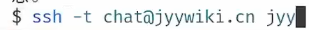

# 操作系统

## 绪论

### 01 - 操作系统概述

1. 
   学习任何东西的目的是：
   
2. 
3. 
4. 与或非可以用 NAND 即与非门实现
   
5. 什么是操作系统？
   - 管理软/硬件资源、为程序提供服务的程序
     - 程序：软件
   - **硬件和软件之间的中间层**
   - 管理硬件和软件的软件
6. 

### 02 - 应用视角的操作系统

1. 从程序的视角上看，**操作系统就是一组 api 和一些对象**
   从硬件的视角上看，**操作系统就是一个普通的 C 程序**
   从数学的视角上看，**操作系统（任何的程序、计算机系统）就是一个严格的数学对象**
2. 

### 03 - 硬件视角的操作系统

### 04 - 数学视角的操作系统

## 并发

## 虚拟化

## 持久化

## 总结

# Questions | Todolists | Notes

1. [TD] 找到视频课 01-操作系统概念 中的命令行 gpt 来自哪里

2. 

3. 
   

4. 

5. [TD] 实现命令行方式的 ai 问答（视频中那样的）

   > 展开说说目前的想法：
   >
   > 显然我可以在公司访问到我的服务器，当然直接访问 ai 也可以。
   > 那么假如访问不了 ai 可以访问我的服务器。
   >
   > 那我去访问我的服务器，然后用服务器去访问 ai，这是不是就是所谓的正向代理。
   >
   > 正向代理和反向代理的区别：
   >
   > ​	正向代理服务于客户端，帮助客户端访问外部资源
   >
   > ​	反向代理服务器后端服务器，帮助它们处理来自客户端的请求（分流器？）

   

6. 

   > 这个系统性自学，说的很好！
   > 这个第二点，让我想起了雷军的自述，直接问学长... 然后大学两年学完了全部课程。

7. 大语言模型推荐：

   - GitHub Copilot
   - chatgpt-4-turbo

8. 

   > 不需要将语言特性、设计模式！编程中自然而然会有体会！

   
   
   
   
   
   （发送 ctrl+z 可以退出)

   > 提示：虽然第一次连接的时候说不安全好像，但是可以连上去的，具体的页面没截图。

9. [TD] 远程连接到我自己电脑上！
